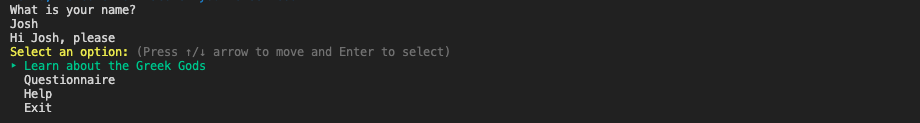
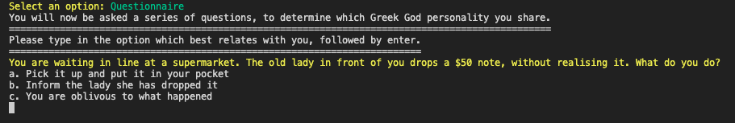
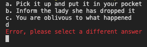
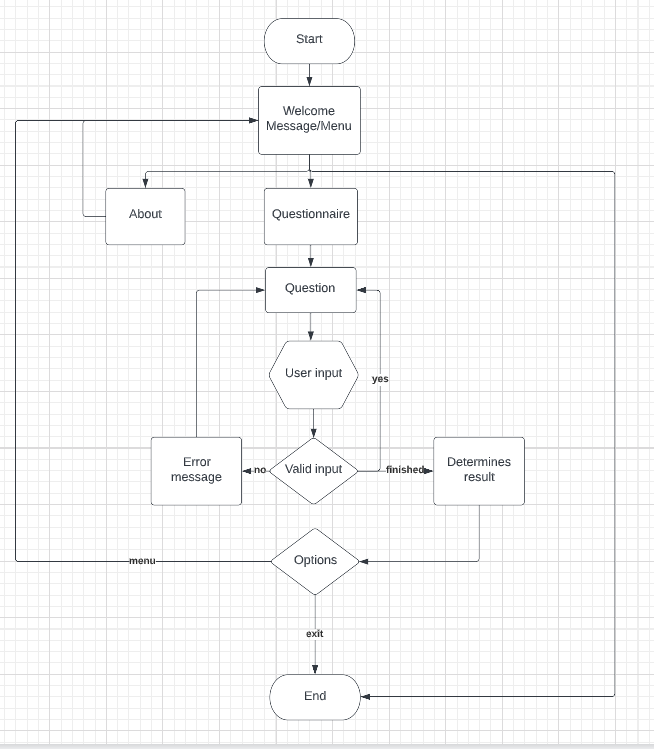
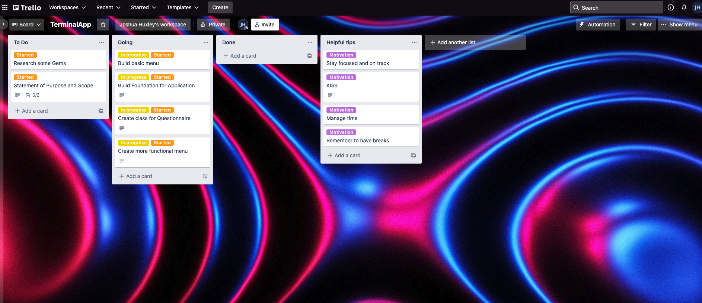

# Discover your Greek God

## Table of contents

- Software Development Plan
- Features
- User Interaction and Experience
- Control Flow Diagram
- Implemention Plan
- Development Log
- Testing
- Ruby Gems
- Installation Instructions

## Software Development Plan

### Statement of Purpose and Scope

Discover your Greek God is designed to match the users personality with a Greek God by answering various questions in the questionnaire. It is a easy to use terminal application and is a fun distraction for people looking to unwind. It was created for enjoyment purposes.

### Target Audience

The app is targeted for people who enjoy quizzes. As most quizzes are long and time consuming, Discover your Greek God is simple, fast and free to try. Users will need to have access to the command line, so it would be more suitable to Mac or Linux users.

## Features

### Learn about the Greek Gods

Discover your Greek God includes three Greek Gods with distinct personalities. To learn abut the personality and type of God they were, users can select the first option, 'learn about the Greek Gods'.

### Questionnaire

The questionnaire is the primary design of this application. Several questions are printed to the screen. These questions present a scenario and ask the user to select one of the pre-defined responses. The user's Greek God is determined by their responses to these questions.

### Help

The help option provides details about the application.

## User Interaction and Experience

The application starts with the main screen being displayed


The user is asked for their name and then asked to select one of the options.



The first option 'Learn about the Greek Gods', has a selection of the three Greek Gods. By selecting one of them, a short detailed information about the God is presented. Detailing what they were the God of and a short summary of their personality.

The second option, the 'Questionnaire' and main feature of the application, is where users are asked a series of questions and must select one of the various answers, in which they most relate to. A small message is conveyed to the user, guiding them on what to do. Then they are immediately asked the first question, and must respond by choosing one of the answers.



If a user enters a invalid key, a error message will be printed alerting them to select one of the options available.



If the user provides a legitimate response, the response is saved and the user is presented with the following question. This loop will continue until all questions have received valid responses. When all of the questions have been answered correctly, the application will present the user their Greek God. That is the end of the application.

The help option provides details about the application.

## Control Flow Diagram



## Implemention Plan

On the day we were told by our educators (Lavanya and Ash) to present our ideas to be approved, at first I had numerous ideas. Though on further thought and discussion with Lavanaya, I decided to come up with a questionnaire application, as I still currently work on Thursdays, Fridays and Saturdays. My other ideas were deemed somewhat to involved, and I could potentially suffer time constraints from my job.
The planning for my app was very simple. At first I created the flowchart. From their I wrote down a overall plan (on pen and paper), in which I wanted to focus primarly on building the main fuction of the app (questinnaire) first.
This was my first time using a trello board, so it took me a while to get use to organising and planning my work on the website. I created cards in which I would use as stepping stones, in order to begin and complete each part.

Screenshot taken from early on in the process of using Trello Board



Link to my [Trello board](https://trello.com/b/3AGly3Z8/terminalapp)

## Development Log

#### Tuesday 12th April

- Discussed application objects with Lavanya. Decided with Greek God questionnaire.
- Made control flow diagram.
- Created Trello board account.
- Researched Ruby gems.

#### Wednesday 13th April

- Started working on building main quiz foundation of app.
- Built a basic menu.

#### Friday 15th April

- Structured quiz in various classes and methods, making code DRY.
- Added in ASCII art into welcome/menu display.
- Imported gems into code e.g TTY-Prompt for menu.

#### Saturday 16th April

- Proceeded to work on quiz. Making sure questions and answers loop together.
- Created README.md

##### Sunday 17th April

- Refactored code in certain functions.
- Tested quiz code, made it DRY again.
- Manual testing.

#### Monday 18th

- Created slidedeck in preparation for presentations.
- First push to github. Initial setup.

Unfortunately I tested positive to corona virus, over the Easter long weekend. As a result, I wasn't able to continually be as productive with my application. Was feeling quite unwell, for most of the week. Because of this, I forgot to keep track of daily development log, and any time I was feeling okay to work, I mainly focused on making the application functional, in order to have something to submit.

## Testing

Most of the testing was manually done. Created various different test files which mainly focused on structuring and flow of the questionnaire.
Running the programme and entering a set of inputs were used to test the application's features. The programme was intended to continue after these inputs were valid. When user inputs were invalid, the application was expected to display a message telling the user that the input was invalid and re-present the question. Tests were carried out by myself, and a friend.
I also installed the ruby gem 'rubocop', which scans code and reports syntax errors.

## Ruby Gems

The following Ruby gems are required to run the application:

- colorize (https://rubygems.org/gems/colorize)
- tty-prompt (https://rubygems.org/gems/tty-prompt)
- crayon (https://rubygems.org/gems/crayon)
- progress_bar (https://rubygems.org/gems/progress_bar)

These gems can be installed by entering the following code in the terminal:

```
gem install colorize
gem install tty-prompt
gem install crayon
gem install progress_bar

```

## Installation Instructins

1. Install Ruby onto your computer. That can be done following the instructions on this [page](https://www.ruby-lang.org/en/documentation/installation/)

2. Install bundler. Run the following command line instruction to install this gem:

```
gem install bundler
```

3. Clone the file from this repository by using the following command line instruction:

```
git clone https://github.com/Huxleyjj/Terminal_App

4. Now you can run the application in your terminal by typing:

```

ruby index.rb

```

```
