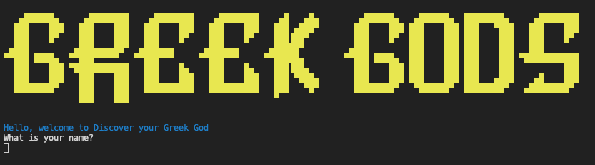

# Discover your Greek God

## Table of contents

- Software Development Plan
- Features
- User Interaction and Experience
- Control Flow Diagram
- Implemention Plan
- Development Log
- Testing
- Ruby Gems
- Help File

## Software Development Plan

### Statement of Purpose and Scope

Discover your Greek God is designed to match the users personality with a Greek God by answering various questions in the questionnaire. It is a easy to use terminal application, which will provide the personality match with users who are bored and need something to do. It is a fun distraction and was created for enjoyment purposes.

### Target Audience

The app is targeted for people who enjoy quizzes. As most quizzes are long and time consuming, Discover your Greek God is simple, fast and free to try. Users will need to have access to the command line, so it would be more suitable to Mac or Linux users.

## Features

### Learn about the Greek Gods

Discover your Greek God includes three Greek Gods with distinct personalities. To learn abut the personality and type of God they were, users can select the first option, 'learn about the Greek Gods'.

### Questionnaire

The questionnaire is the primary design of this application. Several questions are printed to the screen. These questions present a scenario and ask the user to select one of the pre-defined responses. The user's Greek God is determined by their responses to these questions.

### User Interaction and Experience

The application starts with the main screen being displayed

The user is asked for their name and then asked to select one of the options.

